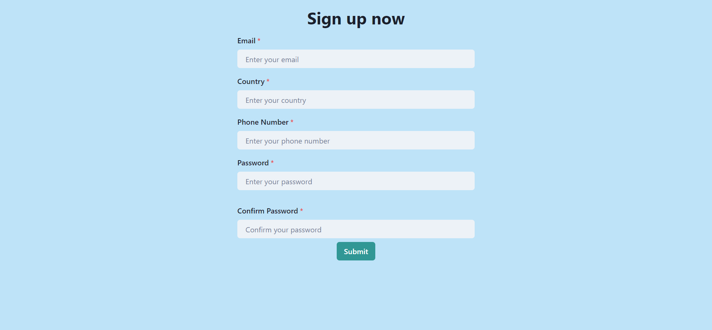

# formik-practice

A project made to practice formik with other frontend skills
This project is remade for my old project : [browser form](https://github.com/ascodeasice/browser-form) from a year ago.

Include validation for multiple fields, show data after submit

## Details

### CICD

- Lint with ESLint
- Test with Jest
- Deploy on Github Pages
- Automated with Github Action

### Frontend

- Formik
- Chakra UI
- TypeScript
- Vite

## Result

## Live Preview

[Link (Github Pages)](https://ascodeasice.github.io/formik-practice/)